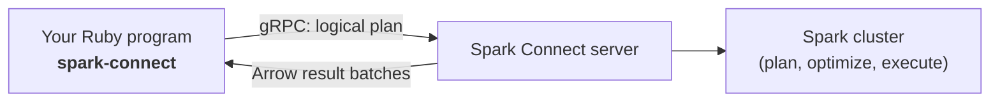

# spark-connect for Ruby
{: .fs-9 }

A production-ready, pure-Ruby client for [Apache Spark Connect](https://spark.apache.org/docs/latest/spark-connect-overview.html) -- a PySpark-style DataFrame API over gRPC.
{: .fs-6 .fw-300 }

[Get started]({{ "/getting-started.html" | relative_url }}){: .btn .btn-primary .fs-5 .mb-4 .mb-md-0 .mr-2 }
[View on GitHub](https://github.com/HyukjinKwon/spark-connect-ruby){: .btn .fs-5 .mb-4 .mb-md-0 }

---

If you have written PySpark, you already know most of this gem. There is no JVM,
no Py4J, and no Spark installation on the client machine -- only a reachable
Spark Connect server.

{: .note }
> **Gem:** [`spark-connect`](https://rubygems.org/gems/spark-connect) &nbsp;|&nbsp;
> **Source:** [HyukjinKwon/spark-connect-ruby](https://github.com/HyukjinKwon/spark-connect-ruby) &nbsp;|&nbsp;
> **Targets** the Spark Connect 4.0 protocol (works with Spark 3.5+ servers).

## What is Spark Connect?

Classic Spark applications run your driver code inside the cluster's JVM. Spark
Connect splits that apart: your program is a thin **client** that builds an
unresolved logical plan and ships it to a remote **server** over gRPC. The
server plans, optimizes, and executes the query, then streams results back as
[Apache Arrow](https://arrow.apache.org/) batches.



Because the protocol is language-agnostic, the client can live in any language.
This gem is that client for Ruby.

## Feature highlights

- **DataFrame API** modeled on PySpark: `select`, `filter`/`where`, `join`, `group_by`/`agg`, `order_by`, `union`, `distinct`, window functions, set operations, sampling, pivot, and more.
- **Snake_case Ruby idiom** with **camelCase aliases** for high-traffic names (`groupBy`, `withColumn`, `orderBy`, `createDataFrame`, ...), so PySpark snippets translate almost verbatim.
- **Spark SQL** via `spark.sql(...)`, including named and positional parameters.
- **A rich function library** under `SparkConnect::Functions` (aliased `SparkConnect::F`).
- **Typed schemas** under `SparkConnect::Types::*`, with DDL strings and `print_schema`.
- **Arrow-based decoding** of results into `Row` objects (or a columnar `Arrow::Table`).
- **Catalog**, **reader/writer**, **NA & stat helpers**, **observations**, and **window specs**.

## Install

```ruby
gem install spark-connect
```

{: .warning }
> `spark-connect` decodes results with [`red-arrow`](https://rubygems.org/gems/red-arrow),
> which requires the **Apache Arrow GLib system libraries**. See
> [Installation]({{ "/installation.html" | relative_url }}) for the one-line setup
> on macOS and Linux.

## Quickstart

```ruby
require "spark-connect"

F = SparkConnect::F

spark = SparkConnect::SparkSession.builder
                                  .remote("sc://localhost:15002")
                                  .app_name("quickstart")
                                  .get_or_create

df = spark.range(10)
          .select(F.col("id"), (F.col("id") * 2).alias("doubled"))
          .filter((F.col("id") % 2) == 0)

df.show
puts "rows: #{df.count}"
spark.stop
```

{: .tip }
> No server handy? The
> [Installation guide]({{ "/installation.html" | relative_url }}#running-a-local-spark-connect-server)
> shows how to start one locally in two commands.

## Where to next

| Guide | What's inside |
| ----- | ------------- |
| [Installation]({{ "/installation.html" | relative_url }}) | Prerequisites, the gem, and a local server |
| [Getting started]({{ "/getting-started.html" | relative_url }}) | Connecting, sessions, your first DataFrames |
| [DataFrames]({{ "/dataframe.html" | relative_url }}) | The full transformation and action surface |
| [Columns & Functions]({{ "/columns-and-functions.html" | relative_url }}) | Expressions and the `F` library |
| [Aggregations & Windows]({{ "/aggregations-and-windows.html" | relative_url }}) | `group_by`, pivot, and analytic windows |
| [Reading & Writing]({{ "/reading-and-writing.html" | relative_url }}) | Sources, sinks, and tables |
| [Types & Schemas]({{ "/types-and-schemas.html" | relative_url }}) | The type system and value mapping |
| [Configuration & Errors]({{ "/configuration.html" | relative_url }}) | Runtime config, observations, error handling |
